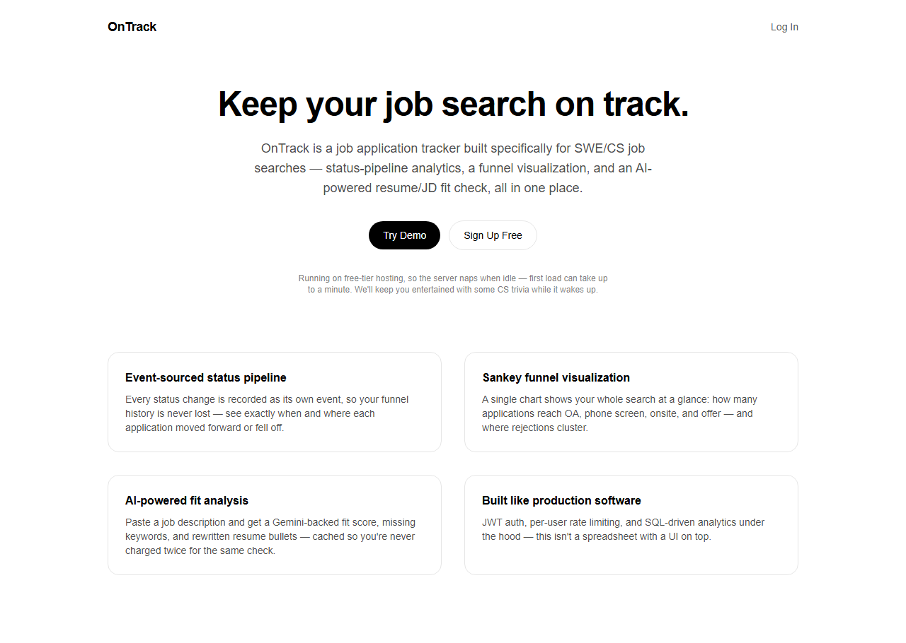
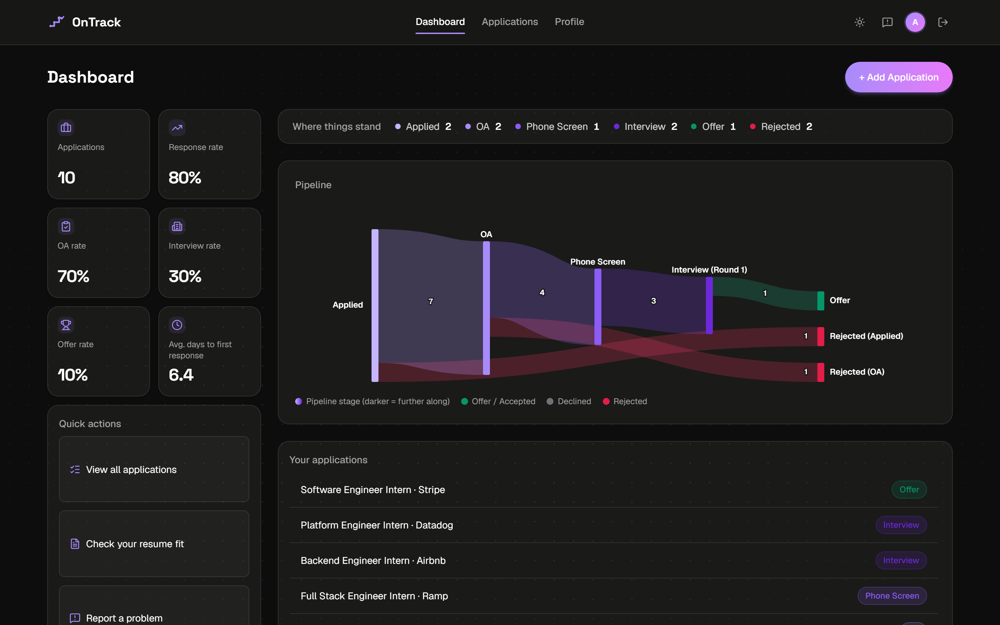
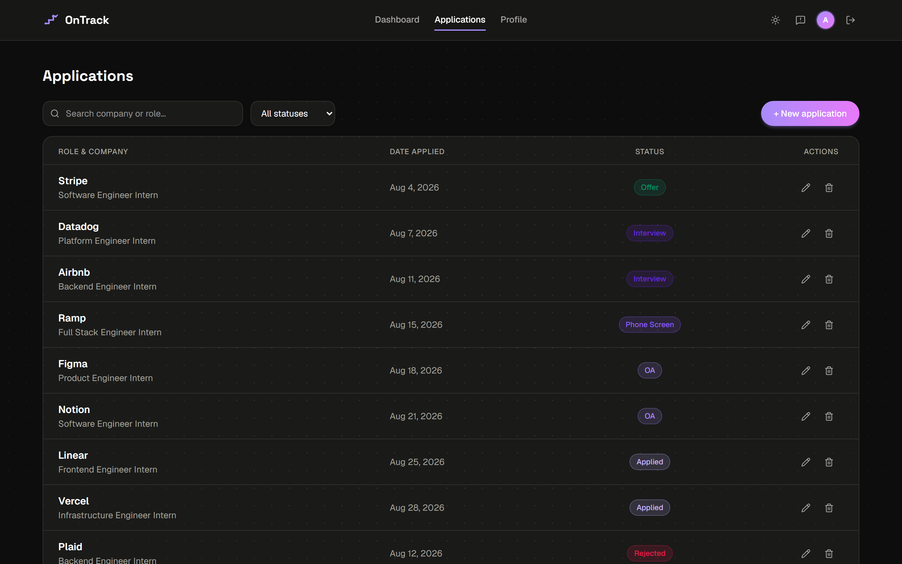
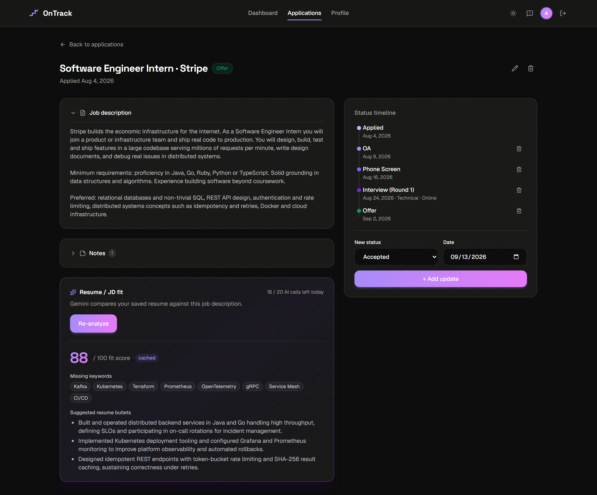

# OnTrack

A full-stack job application tracker website built for general CS job searches. Features include a dashboard containing an application status pipeline and application statistics, application manager, and a Gemini-powered resume and job-description fit check.

**Live demo:** [ontrack.abhinavgonthina.me](https://ontrack.abhinavgonthina.me). Click "Try Demo" for a read-only tour with seeded data, or sign up for your own account!

> The way the backend is hosted right now, it spins down after 15 minutes idle. First load after a nap might take up to two and a half minutes to wake back up. The UI includes this detail, and will keep you occupied with a 100-question CS and SWE interview quiz while it boots.

## Screenshots

**Landing page**



**Dashboard: stage counts, funnel metrics, and a Sankey diagram of the whole pipeline**



**Applications: searchable, filterable and paginated**



**Application detail: status timeline, notes, and the Gemini fit analysis**



> Earlier versions of the interface are archived in [`docs/screenshots/legacy-ui/`](docs/screenshots/legacy-ui/).

## What it does

- **Track applications** through a full status pipeline (Applied, OA, Phone Screen, Interview, Offer, then Accepted or Declined, with a rejection possible at any stage), keeping a timeline of every change and free-form notes per application.
- **See the whole funnel at a glance.** The dashboard shows how many applications currently sit at each stage, response and OA and interview and offer rates, and a Sankey diagram of exactly where applications progressed or fell off. It is computed server-side with a SQL window function over the append-only status history, not from each application's latest status.
- **Check your resume against a job description.** Paste a JD and get a Gemini-backed fit score, the keywords you are missing, and rewritten resume bullets. Results are cached on a hash of the resume and JD pair, so re-opening a result never costs another API call.
- **Upload a resume as PDF or DOCX**, have it normalized into clean text, and score its strength across four fixed categories. Strength scores are cached against the resume text, so re-scoring unchanged text is free.
- **Try it with zero setup** through a public, read-only demo with 12 seeded applications and no signup.

## Why it is built

I created this project as a way to track my own job search. I wanted to create a hub where I can track the overall progression of my job search without having to manually calculate anything or us more than one source to do so. In r/NEU (Northeastern's reddit), often times people will post the results of their internship/co-op search by means of a sankey diagram - https://en.wikipedia.org/wiki/Sankey_diagram. This web app combines that with the basic CRUD features that someone would want to keep track of their application, and also incorporates an integrated AI review aspect in case you want quick tips on how to tweak your resume for a specific job description/a better general resume.

## Tech stack

**Backend:** Java 21, Spring Boot 4.1, Spring Data JPA plus `NamedParameterJdbcTemplate`, Spring Security 7 with JWT via `jjwt`, Flyway migrations, Bucket4j rate limiting, PostgreSQL on Neon, deployed to Render via Docker.

**Frontend:** Next.js 16 (App Router), React 19, TypeScript, Tailwind CSS v4, Recharts for the Sankey diagram, deployed on Vercel.

**AI:** Google Gemini (`gemini-3.5-flash-lite`, pinned rather than a `-latest` alias) through Spring's `RestClient`, using structured JSON output and SHA-256 input-hash caching.

**Email:** Resend, for verification, password reset and problem reports.

**Testing:** JUnit 5 with Mockito and MockMvc on the backend (177 tests), Vitest with React Testing Library on the frontend (201 tests).

## Architecture

```
frontend/   Next.js app. All AI and database access goes through the
            backend API, never directly from the browser
backend/    Spring Boot API: auth, CRUD, rate limiting, Gemini proxy,
            SQL analytics
```

## Running it locally

**Backend** (needs a Postgres database, and Neon's free tier works well):

```bash
cd backend
cp .env.example .env   # fill in DATABASE_URL, JWT_SECRET, GEMINI_API_KEY
./mvnw spring-boot:run
```

**Frontend:**

```bash
cd frontend
npm install
npm run dev
```

The frontend expects the backend at `NEXT_PUBLIC_API_URL`, which defaults to `http://localhost:8080`.
