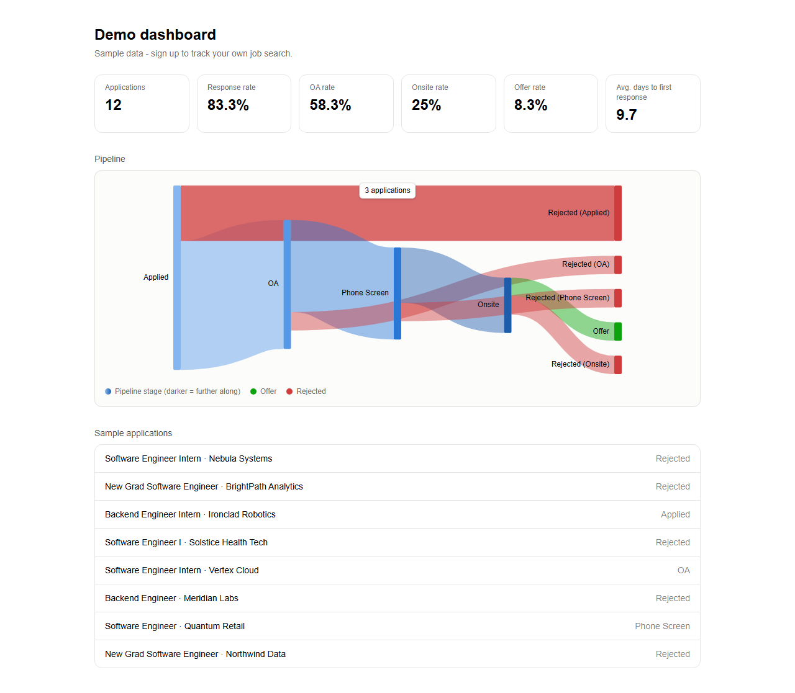
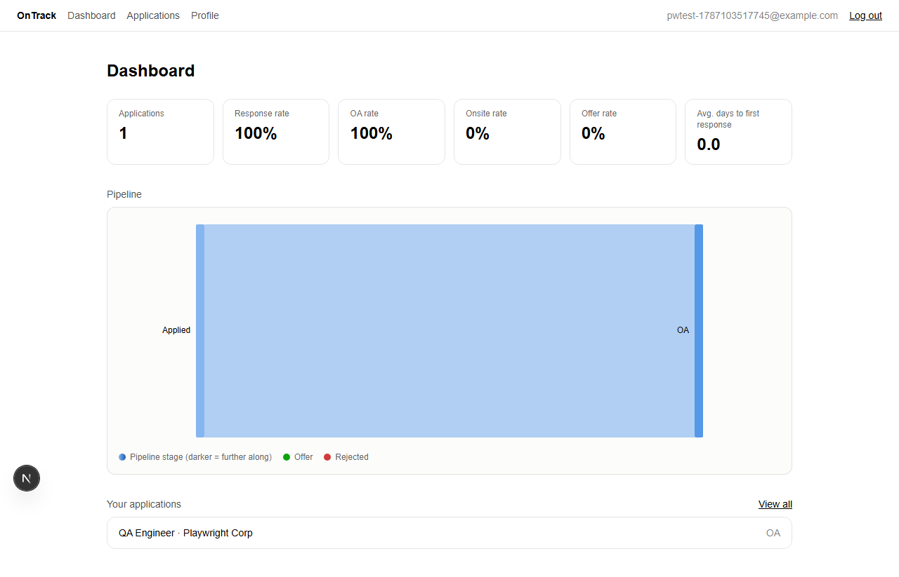
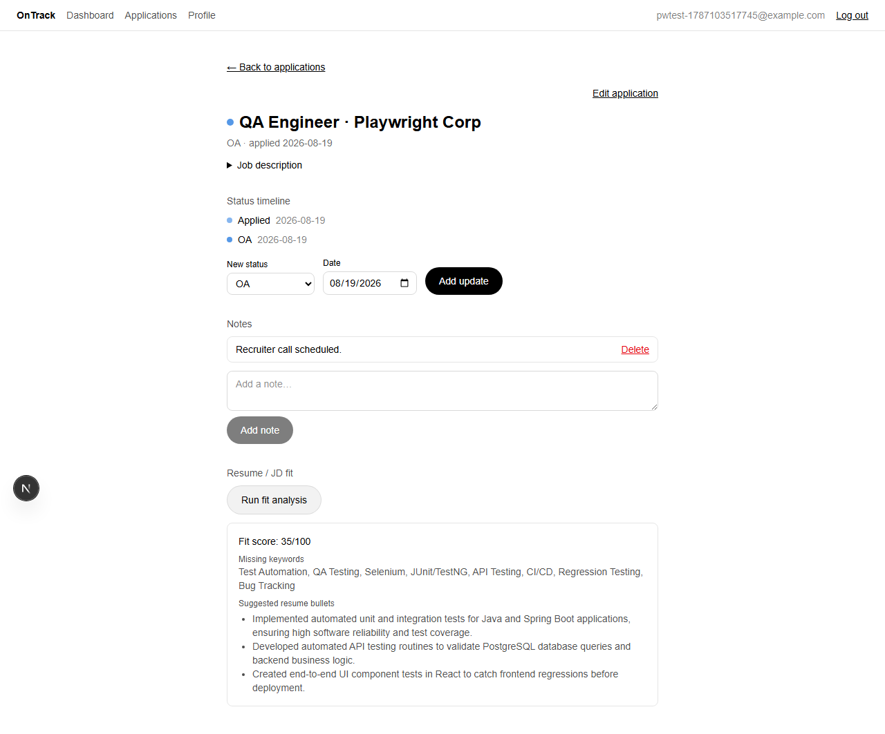

# OnTrack

A full-stack job application tracker built for SWE/CS job searches. It combines an event-sourced status pipeline, SQL-driven funnel analytics with a Sankey visualization, and a Gemini-powered resume/job-description fit check, all on top of a real JWT-authenticated CRUD backend.

**Live demo:** [ontrack.abhinavgonthina.me](https://ontrack.abhinavgonthina.me). Click "Try Demo" for a read-only tour with seeded data, or sign up for your own account.

> The backend runs on Render's free tier, which spins down after 15 minutes idle. First load after a nap takes up to a minute to wake back up. The UI tells you what's happening and keeps you entertained with a 100-question CS/SWE interview trivia quiz while it does. This is a deliberate trade for a $0 always-available demo link, not an oversight.

## Screenshots

**Landing page**


**Dashboard: funnel stats and a Sankey diagram of the status pipeline**



**A real user's dashboard after adding an application**



**AI-powered resume/JD fit analysis (real Gemini call)**



## What it does

- **Track applications** through a full status pipeline (Applied → OA → Phone Screen → Onsite → Offer, or Rejected at any stage), with a timeline of every status change and free-form notes per application.
- **See the whole funnel at a glance.** A dashboard with response/OA/onsite/offer rates and a Sankey diagram showing exactly where applications progress or fall off, computed server-side via a SQL window function over the append-only status-event history (not just the latest status).
- **Check your resume against a job description.** Paste a JD and get a Gemini-backed fit score, missing keywords, and rewritten resume bullets. Results are cached by a hash of the resume+JD pair, so re-viewing a result never re-calls the AI or costs anything twice.
- **Try it with zero setup.** A public, read-only demo mode with 12 realistic seeded applications and no signup required.

## Why it's built this way

This project exists to demonstrate real backend engineering, not to be an AI wrapper. The AI feature (fit analysis) is one feature among several. The CRUD, the event-sourced status model, and the SQL analytics are all meant to stand on their own in a technical interview:

- **Event-sourced status pipeline.** Status changes are appended as immutable `StatusEvent` rows, not overwritten in place. The full history survives, funnel analytics can be recomputed at any time, and "how many applications ever reached OA" is an honest query instead of an assumption.
- **SQL over an ORM shortcut for analytics.** The Sankey computation needs a `LAG()` window function to compare each status event with the previous one per application, which JPQL can't express. `StatsService` uses `NamedParameterJdbcTemplate` with raw SQL for exactly this, while the rest of the app uses Spring Data JPA where a repository is the right tool.
- **Abuse/cost protection is treated as a first-class feature, not an afterthought.** General API rate limiting (Bucket4j, 60 req/min per user/IP) is separate from a dedicated Gemini rate limiter (20 calls/day per user, persisted in Postgres so it survives restarts) that's only consulted on an actual cache miss. Free cached re-reads never count against the budget, but real AI calls are capped even if a user or a script tries to hammer the endpoint.
- **No credentials in browser storage.** The JWT lives in React context only, never in `localStorage` or `sessionStorage`, so there is nothing for an XSS payload to exfiltrate and a hard refresh logs you out by design, not by bug. The one thing that does persist client-side is a single non-sensitive theme cookie, because a colour preference is worth keeping across refreshes and reading it server-side is what stops the page flashing the wrong palette on load. The line is drawn at sensitivity, not at storage mechanics.

## Tech stack

**Backend:** Java 21, Spring Boot 4.1.0, Spring Data JPA + `NamedParameterJdbcTemplate`, Spring Security 7 (JWT via `jjwt`), Flyway migrations, Bucket4j rate limiting, PostgreSQL (Neon), deployed on Render via Docker.

**Frontend:** Next.js 16 (App Router), React 19, TypeScript, Tailwind CSS v4, Recharts (Sankey diagram), deployed on Vercel.

**AI:** Google Gemini (`gemini-3.5-flash-lite`, pinned rather than a `-latest` alias) via Spring's `RestClient`, structured JSON output, SHA-256 input-hash result caching.

**Testing:** JUnit 5 + Mockito + MockMvc (backend), Vitest + React Testing Library (frontend).

## Architecture

```
frontend/   Next.js app. All AI/DB access goes through the backend API,
            never directly from the browser
backend/    Spring Boot API: auth, CRUD, rate limiting, Gemini proxy,
            SQL analytics
```

The Gemini API key never reaches the frontend. Every AI call is proxied through the backend, which is also where the rate limiting and caching live. Demo mode never makes a live Gemini call; it serves pre-seeded, hash-matched `FitAnalysis` rows through the exact same cache-hit code path a real cached result would use.

## Running it locally

**Backend** (needs a Postgres database, and Neon's free tier works well):
```bash
cd backend
cp .env.example .env   # fill in DATABASE_URL, JWT_SECRET, GEMINI_API_KEY
./mvnw spring-boot:run
```

**Frontend:**
```bash
cd frontend
npm install
npm run dev
```

The frontend expects the backend at `NEXT_PUBLIC_API_URL` (defaults to `http://localhost:8080`).
